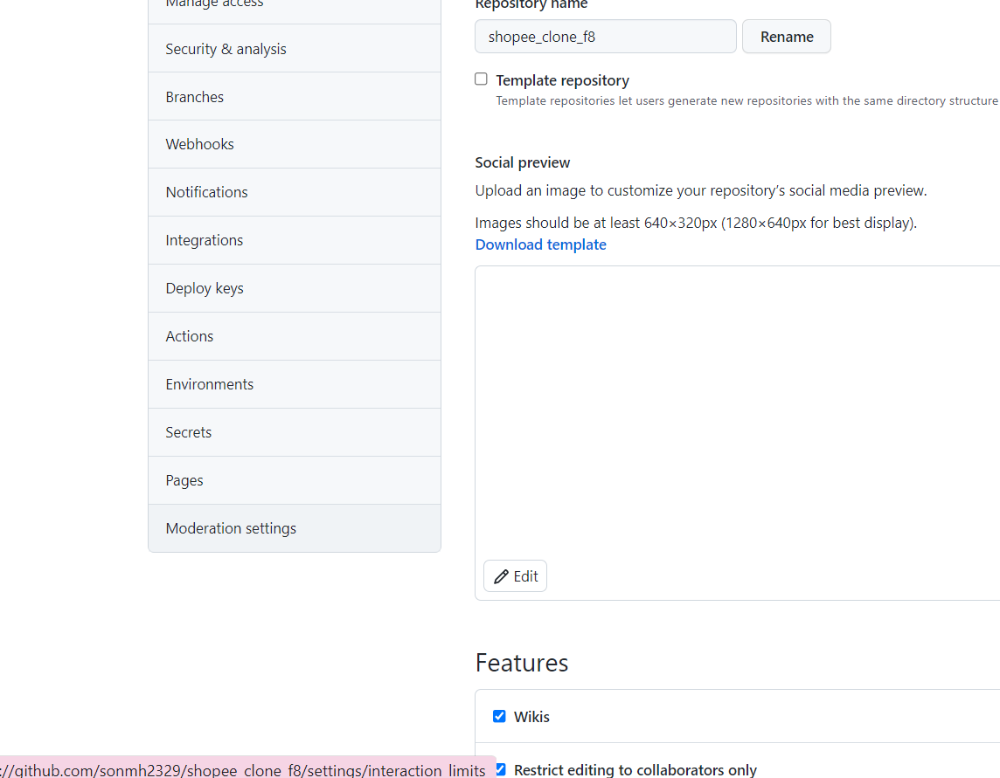

# Git tutorial

1. Tải git về [https://git-scm.com/downloads](https://git-scm.com/downloads)

2. Tải về cài đặt các thứ nó sẽ cho một cái gọi là git cmd.


3. Cái này dùng để up code

4. Đăng kí và Đăng nhập vào git

5. Vào `settings` Set `default` branch cho git


6. Tạo repository mới


Quên phần này bỏ cái tick add `README.md` đi, chỉ set tên rồi enter để nó hiện ra cái chỉ dẫn dưới

Mở Git cmd lên và `cd` vào thư mục chứa project ( thư mục mà file index.html nằm ngoài cùng)


**Chú ý trong các thao tác thực hiện dưới đấy, nếu như lần đầu dùng git mà nó có hỏi tài khoản mật khẩu thì nhập tk, mật khẩu vào, nếu nhập vào mà không được thì kéo xuống dưới xem phần generate token. Cái token này thay cho pwd, git mới cập nhật.**

Gõ:
## B1

```git
    git init
```

Đơn giản là để thêm quyền quản lý project của git cho cái project của mình.

## B2

```git
    git add "tên file"
```

Để thêm file muốn đẩy lên git. Hoặc:

## B3

```cmd
    git add .
```

Để add tất cả các thay đổi hoặc file nào đó mới thêm. Để đơn giản thì auto dùng cái `git add .` này

## B4

```cmd
    git commit -m "nội dung sửa, xóa,... cv thực hiện thay dổi"
```

## B5

git commit để đẩy file đã modify vào commit để chuẩn bị đẩy lên github.

Mới tạo file thì cop cái này vào sau đó enter là xog


- Cho các lần thực hiện thay đổi và đẩy thay đổi lên github cho repository cũ đã tạo trước đó:
  - cd vào thư mục chứa code cần đẩy. Bỏ qua bước init, thực hiện đến B5 thì chỉ cần thêm

```git
    git pull
    git push
```

Không cần `remote origin` các kiểu nữa vì đã có file `.git` (file này được ẩn đi, chứa các quản lý của git lên project của mình).

**Có thể xóa file tại máy đi khi xác định k động đến nữa. Khi nào cần chỉ cần mở git cmd lên và thực hiện:**

```git
    git clone xxxxxx
```

Trong đó `xxxxx` là cái đường dẫn mình có thể lấy trong repository trên github:


Sau đó thực hiện công việc gì thì thực hiện. xong thì lại add. rồi commit, pull, push như trên kia.

7. Để host page của mình:

Chú ý nên để file index.html ở ngoài cùng như hình bên trên kia.

Vào `setting`


vào `pages`



Chọn như hình rồi ấn `save`


Nhìn dòng chữ xanh là đã host thành công và đường link dẫn đến pages.


**Nếu nhỡ nó có yêu cầu token để đăng nhập git từ git cmd(cái này nó mới cập nhật hôm 13/:8**

## B1:

Vào setting


## B2:

Vào đây


## B3:

generate token


## B4: 


# B5:

Chọn tick hết rồi ấn generate


Sau khi tạo. Nó sẽ cho mình một cái mã, đừng vội thoát đi đâu, nhớ cop lưu lại cái token vì nếu thoát page là nó ẩn đi luôn. Cái token này sẽ thay mật khẩu đăng nhập kiểu cũ. Lần đầu khi push code lên có lẽ nó sẽ yêu cầu user, pwd thì cái pwd chính là cái này.

# B6:

Còn nếu lần đầu nó không hỏi mà các lần sau nó hỏi thì nếu cái token còn hạn. Vào đấy để thay đổi default token cho truy cập git


# B7:


Có gì thì tham khảo thêm trên mạng :V.
